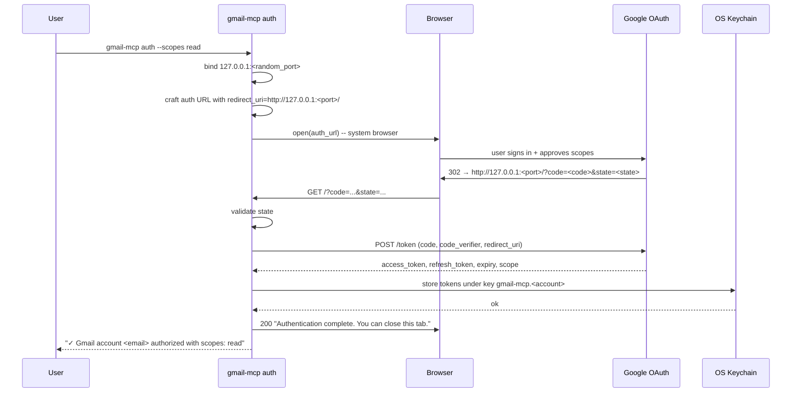
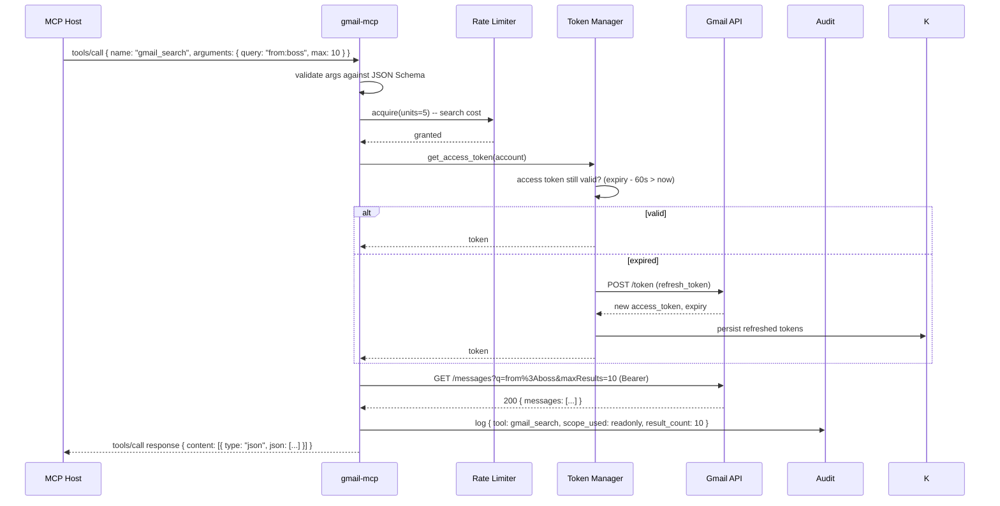
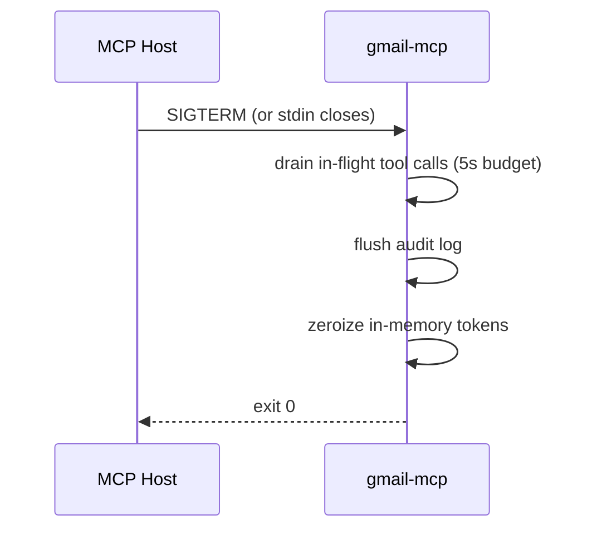

# Gmail MCP Server — Data & Control Flow

> Sequence diagrams for the OAuth flows, the MCP lifecycle, and a tool call — plus every error branch that matters.

---

## Boot sequence

```mermaid
sequenceDiagram
    participant H as MCP Host
    participant G as gmail-mcp (binary)
    participant K as OS Keychain
    participant L as Rate Limiter
    participant API as Gmail API

    H->>G: spawn `gmail-mcp serve --account default`
    G->>G: parse config (account, scopes, transport)
    G->>K: fetch tokens for account "default"
    alt tokens present
        K-->>G: (access_token, refresh_token, expiry)
    else tokens missing
        G-->>H: exit with "no credentials; run `gmail-mcp auth`"
    end
    G->>G: build RateLimiter (200 units/s/user)
    G->>G: build Gmail client (tokens + limiter)
    G->>H: ready on stdin/stdout
    H->>G: initialize
    G-->>H: protocolVersion, capabilities, serverInfo
    H->>G: notifications/initialized
    H->>G: tools/list
    G-->>H: [23 tools + JSON schemas]
    Note over H,G: steady state — host calls tools/call on demand
```

---

## OAuth — desktop loopback flow (default)



Implementation notes:
- **PKCE** always on (`code_challenge_method=S256`). The `code_verifier` never leaves the process.
- **State parameter** is 32 bytes of CSPRNG, compared on callback.
- **Listener timeout** 5 minutes. After that the server exits with a clear message.
- **Scope-to-preset mapping:** `read` ↔ `gmail.readonly`, `write` ↔ `gmail.modify`, `full` ↔ `gmail.modify + gmail.settings.basic`.
- **Client ID:** embedded default, overridable via `--client-id` flag or `GMAIL_MCP_CLIENT_ID` env var. Enterprise users bring their own.

---

## OAuth — device code flow (headless)

```mermaid
sequenceDiagram
    participant U as User (SSH'd in)
    participant G as gmail-mcp auth --device
    participant A as Google OAuth
    participant B as Browser (separate device)
    participant K as OS Keychain

    U->>G: gmail-mcp auth --device --scopes read
    G->>A: POST /device/code
    A-->>G: device_code, user_code, verification_url, expires_in, interval
    G-->>U: "Go to https://www.google.com/device and enter code: ABCD-EFGH"
    U->>B: navigate + enter code + sign in
    loop every `interval` seconds
        G->>A: POST /token (device_code, grant_type=device_code)
        alt pending
            A-->>G: error=authorization_pending
        else approved
            A-->>G: access_token, refresh_token, expiry
            G->>K: store tokens
            G-->>U: "✓ Authorized"
        else expired
            A-->>G: error=expired_token
            G-->>U: "Code expired; re-run `gmail-mcp auth --device`"
        end
    end
```

---

## Service account flow (Workspace only)

```mermaid
sequenceDiagram
    participant U as Workspace admin
    participant G as gmail-mcp auth --service-account
    participant A as Google OAuth (JWT)
    participant K as OS Keychain

    U->>G: --key-file /path/to/sa.json --impersonate user@corp.com
    G->>G: load service account JSON
    G->>G: sign JWT (iss=sa_email, sub=user@corp.com, aud=oauth2...)
    G->>A: POST /token (assertion=jwt, grant_type=jwt-bearer)
    A-->>G: access_token (1h; no refresh_token — we mint JWTs on demand)
    G->>K: store {service_account_json, impersonate} ref
    K-->>G: ok
    G-->>U: "✓ Service account configured for user@corp.com"
```

Note: no refresh token in this flow. The server mints a new JWT each hour, signs with the SA key from the keychain.

---

## Tool call — `gmail_search`



---

## Error branches

### Auth expired / revoked

```
T: refresh_token → Gmail API
API → 400 invalid_grant
G: AuditEvent::AuthRevoked { account }
G: respond with typed error AuthRevoked
H: surfaces "Re-authorize: gmail-mcp auth --account default" to user
```

### Scope missing

```
H: tools/call { name: "gmail_send", ... }
G: check tool → required_scope = gmail.send
G: check active scopes from last token response
G: required ⊄ active
G: respond with ScopeMissing { required: ["gmail.send"] }
H: surfaces "Grant send scope: gmail-mcp auth --scopes read,send"
```

### Rate limited by Gmail

```
API → 429 Too Many Requests  (retry-after: 3)
L: record 429
G: sleep 3s + jitter
G: retry once
API → 200
G: complete (but log quota pressure)
— or —
G: second 429 within window
G: respond with RateLimited { retry_after: 5s }
H: surface to user; optionally retry later
```

### Quota exhausted

```
API → 403 quotaExceeded
G: do NOT retry
G: respond with QuotaExhausted
H: surface; user resolves out-of-band (wait until tomorrow or bump GCP quota)
```

### Attachment too large

```
H: tools/call { name: "gmail_download_attachment", ... }
G: fetch attachment metadata
G: size = 28 MB > Gmail 25 MB limit (API-enforced on send, not download)
  OR: size > --max-attachment-mb config (e.g. 10 MB)
G: respond with AttachmentTooLarge { size, limit }
H: surface
```

### Malformed query

```
H: tools/call { name: "gmail_search", arguments: { query: "from:@@@", max: 0 } }
G: JSON Schema rejects (max must be 1..=500)
G: respond with InvalidQuery { reason: "max must be 1..=500" }
— or schema passes, Gmail rejects —
API → 400 invalidQuery
G: respond with InvalidQuery { reason: "unrecognized token '@@@'" }
```

---

## Shutdown



If the host sends no SIGTERM and just SIGKILLs — that's fine, all state worth keeping is either in the keychain or already flushed.

---

## Related

- [[Gmail MCP Server Plan]]
- [[Gmail MCP Server Research]]
- [[03-oauth-flow-and-token-storage]]
- [[07-production-hardening]]
