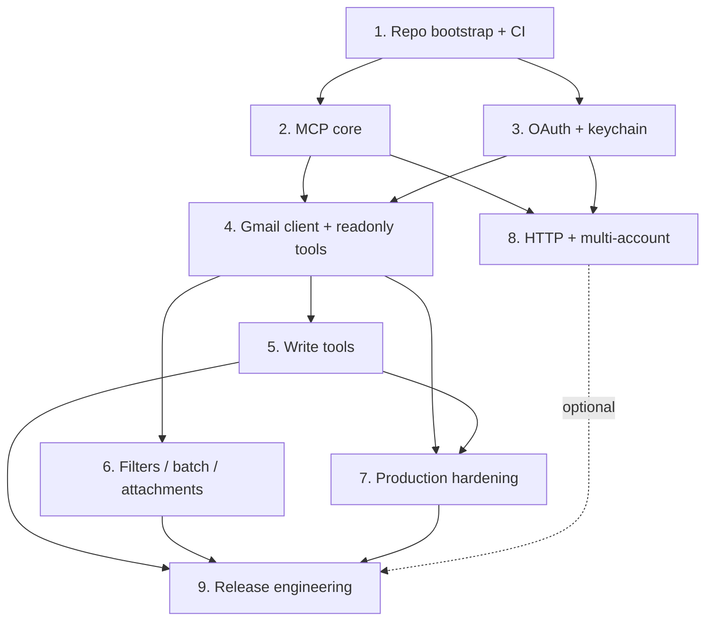

# Gmail MCP Server — Standalone, Production-Grade, Rust

> A first-class Gmail MCP server shipped as a signed static binary. Standalone repository. MCP-compliant, so every MCP host (AgentOS, Claude Desktop, Cursor, Cline, OpenClaw) works out of the box.

---

## Why this exists

The existing Gmail MCP servers on npm are unsuitable for production:

- `@gongrzhe/server-gmail-autoauth-mcp` — upstream archived, plaintext token storage, hardcoded `gmail.modify` scope, no tests, no CI, MCP SDK pinned pre-1.0. Not safe for enterprise. (See [[MCP Catalog Installer Research]] for the full audit.)
- `@shinzolabs/gmail-mcp` — small community, narrower feature set, Node runtime.
- `taylorwilsdon/google_workspace_mcp` — best open-source option, but Python, broader scope (harder to audit), token storage still file-based.
- Anthropic-hosted Gmail connector — only available on Claude platform; not portable to self-hosted AgentOS/OpenClaw/Cursor/Cline deployments.

There is no production-grade standalone option. We build it.

---

## Product outcome

A user running any MCP-compatible host does this:

```bash
# One-time
brew install agentos-foundry/tap/gmail-mcp        # or `cargo install` or `docker pull`
gmail-mcp auth                                    # OAuth loopback flow, tokens in OS keychain

# Wire into any MCP host
# AgentOS:   agentos mcp install gmail
# Claude:    claude_desktop_config.json entry
# Cursor:    .cursor/mcp.json entry
# OpenClaw:  the same stdio command
gmail-mcp serve
```

Tokens never touch disk as plaintext. Scopes are least-privilege by default. Releases are signed. No runtime install. No OAuth dance in a separate terminal.

---

## Scope & non-goals

**In scope (v1):**
- Gmail only — messages, threads, labels, filters, drafts, attachments.
- Desktop OAuth flow (loopback) + device code flow + service account for Workspace.
- OS keychain storage (macOS Keychain, Windows Credential Manager, libsecret) with encrypted file fallback.
- stdio transport (v1) + HTTP/SSE transport (v2 stretch).
- Multi-account support.
- Rate limiting, retries, audit logging, typed errors.
- Signed binary releases for Linux/macOS/Windows on x86_64 + arm64.

**Out of scope (v1):**
- Calendar, Drive, Docs. Future siblings under a possible `google-workspace-mcp` umbrella, but each gets its own tightly-scoped server.
- A GUI. The auth flow uses the browser; the server itself is headless.
- Plugins for other email providers (Outlook, Fastmail). Addressable later by protocol-adjacent servers.

**Explicit non-goal:** AgentOS coupling. The server does not import any `agentos-*` crate at runtime. It speaks MCP, nothing else. AgentOS integrates via the catalog (Phase 6 of [[MCP Catalog Installer Plan]]).

---

## Repository & package

- **Repo:** `github.com/<org>/gmail-mcp` (separate from `agos`).
- **Crate name:** `gmail-mcp` (Cargo workspace root).
- **Binary:** `gmail-mcp`.
- **License:** Apache-2.0 OR MIT (dual).
- **Distribution:** GitHub Releases (signed tarballs), `cargo install gmail-mcp`, Homebrew tap, Docker image.

---

## Target architecture

```
┌─────────────────── MCP client (AgentOS / Claude / Cursor / …) ────────────────┐
│                                                                               │
│  spawn stdio subprocess: `gmail-mcp serve --account default`                  │
│                                                                               │
└────────────┬──────────────────────────────────────────────────────────────────┘
             │ JSON-RPC 2.0 over stdin/stdout
             ▼
┌──────────────────────────── gmail-mcp binary ─────────────────────────────────┐
│  mcp::protocol        — handshake, tools/list, tools/call                     │
│       │                                                                       │
│       ▼                                                                       │
│  tools::{search,read,send,draft,labels,filters,threads,attachments,…}         │
│       │                                                                       │
│       ▼                                                                       │
│  gmail::client         — google-gmail1 crate wrapper, rate-limited            │
│       │                                                                       │
│       ▼                                                                       │
│  auth::{oauth,keychain,tokens}                                                │
│       │                                                                       │
│       ▼                                                                       │
│  OS keychain / encrypted file  ────► Google OAuth token endpoint              │
└───────────────────────────────────────────────────────────────────────────────┘
```

Every layer is testable in isolation. The top-of-file `main.rs` is under 100 lines — wires config, keychain, Gmail client, tools, MCP server.

---

## Phase overview

| Phase | Name | Effort | Dependencies | Detail Doc | Status |
|-------|------|--------|-------------|------------|--------|
| 1 | Repository bootstrap & CI baseline | 1d | None | [[01-repo-bootstrap-and-ci]] | planned |
| 2 | MCP protocol core & stdio transport | 1.5d | Phase 1 | [[02-mcp-protocol-and-stdio]] | planned |
| 3 | OAuth flow & keychain-backed token storage | 2d | Phase 1 | [[03-oauth-flow-and-token-storage]] | planned |
| 4 | Gmail API client + readonly tools | 2d | Phase 2, 3 | [[04-gmail-client-and-readonly-tools]] | planned |
| 5 | Write tools (send / draft / modify / delete) | 1.5d | Phase 4 | [[05-write-tools-send-draft-modify]] | planned |
| 6 | Filters, batch operations, attachments | 1d | Phase 4 | [[06-filters-batch-attachments]] | planned |
| 7 | Production hardening (rate-limit / retries / audit / error taxonomy) | 1.5d | Phase 4, 5 | [[07-production-hardening]] | planned |
| 8 | HTTP/SSE transport + multi-account (stretch) | 2d | Phase 2, 3 | [[08-http-transport-multi-account]] | planned |
| 9 | Distribution & release engineering (signing, brew, docker) | 1.5d | All prior | [[09-distribution-and-releases]] | planned |

**Total:** ~14 days one engineer, or ~8 days excluding Phase 8.

---

## Phase dependency graph



---

## Key design decisions

1. **Rust over Node/Python.** Single static binary, no runtime install, predictable cold start, memory-safe, easier supply-chain audit. Node/Python variants failed on those exact points in the audit.
2. **MCP compliance is the only coupling.** No AgentOS-specific types, configs, or daemons in the server. Works anywhere MCP does.
3. **OS keychain is the default secret store.** The `keyring` crate abstracts macOS Keychain, Windows Credential Manager, and Linux Secret Service. Plaintext file mode is gated behind `--token-store file` with a loud warning.
4. **Least-privilege scopes.** Default scopes grant read-only access. Each write action requires opting in via `--scopes send` / `--scopes modify` / etc. Tools that require an un-granted scope return a typed error the client can surface as "grant more permissions."
5. **Per-subcommand OAuth grants (stretch).** Advanced users can run `gmail-mcp auth --scopes read,send` to grant exactly what they want. v1 ships 3 preset profiles: `read`, `write`, `full`.
6. **`google-gmail1` crate as the API client.** Actively maintained, matches the Gmail REST API shape, minimal custom JSON logic. Alternative (`gmail-api-rust`) is less complete.
7. **Rate limiting lives in the server, not the client.** Token-bucket at the HTTP client layer; 429s trigger exponential backoff with jitter. Clients are insulated from the Gmail quota model.
8. **Audit log emits structured JSON to stderr.** Any MCP host can capture + route it. No opinion on storage — syslog, file, stderr tap all work.
9. **No built-in web UI.** Reduces attack surface. Users run `gmail-mcp auth` once, browser pops up via loopback, they're done.
10. **Distribution: reproducible builds + sigstore signatures.** Same discipline as `sigstore/cosign` or `astral-sh/uv`. Homebrew tap and Docker image are conveniences over the signed tarball.
11. **Multi-account via `--account <name>` flag.** One keychain entry per account. The server exposes a single Gmail identity at a time; a client that wants multiple accounts spawns multiple server processes.
12. **No auto-update.** Releases are pulled explicitly. Auto-update machinery is a security risk not worth it for a 2 MB binary.

---

## Risks

| Risk | Mitigation |
|------|------------|
| Gmail API changes break the server | Pin `google-gmail1` minor; run integration test suite weekly; label breaking-change bumps as MAJOR |
| `keyring` crate edge cases on Linux (no running Secret Service) | Detect at startup; fall back to encrypted file with loud warning; never silently downgrade |
| OAuth client ID distribution — embedding a shared ID in a public binary | Offer two modes: (1) embedded "community" client ID with Google-enforced rate limits, (2) BYO client ID via `--client-id`/env; document the tradeoff. Enterprise users should use their own GCP project. |
| Supply-chain attack on a dependency | Pin all versions; `cargo audit` in CI; minimal dep list (~15 crates); quarterly dep-review |
| Token exfiltration via malicious sibling process (user-space attacker) | Keychain storage per-user ACL; warn on file mode; document threat model clearly in SECURITY.md |
| Gmail rate-limit exhaustion | Per-tool budgets + exponential backoff + explicit `RateLimited` error that clients can surface to users |
| MCP spec churn | Track the official MCP SDK; ship within 1 minor of latest; integration tests pin spec version |
| Distribution trust — users downloading from GitHub Releases | cosign signatures + SBOM + `gh release download` works out of the box; Homebrew tap verifies checksums |
| Licensing of Gmail API brand | No use of "Gmail" trademark in the binary name/logo; call it "gmail-mcp" (function, not brand); include Google's required attribution per API ToS |

---

## Success criteria

v1 ships when all of the following are true:

- [ ] `cargo test --workspace` is green and covers every tool with at least one success case and one typed error case.
- [ ] CI on Linux + macOS + Windows produces signed binaries for x86_64 and arm64.
- [ ] End-to-end integration test runs against a real Gmail test account, all 25+ tools exercised.
- [ ] `cargo audit` reports no known vulnerabilities.
- [ ] `gmail-mcp auth` completes the flow and persists a token in the OS keychain with no filesystem writes.
- [ ] AgentOS catalog entry installs and runs the server via `agentos mcp install gmail`.
- [ ] Claude Desktop `claude_desktop_config.json` entry works.
- [ ] Cursor `.cursor/mcp.json` entry works.
- [ ] OpenClaw or another third-party MCP host confirms compatibility.
- [ ] SECURITY.md published with threat model and disclosure policy.
- [ ] README documents all three scope presets and includes a troubleshooting section.

---

## Related

- [[Gmail MCP Server Research]] — audit synthesis and design rationale
- [[Gmail MCP Server Data Flow]] — protocol + OAuth sequence diagrams
- [[MCP Catalog Installer Plan]] — AgentOS-side catalog entry that installs this server
